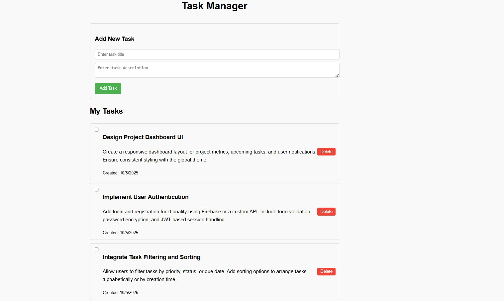

# Task Manager App


A modern, responsive task management application built with Vue.js and Nuxt.js. This project demonstrates component-based architecture, state management, and reactive programming concepts.

## 🚀 Features

- ✅ **Add Tasks**: Create new tasks with title and description
- ✏️ **Edit Tasks**: Mark tasks as complete or incomplete
- 🗑️ **Delete Tasks**: Remove tasks you no longer need
- 💾 **Local Storage**: Automatically saves tasks to browser storage
- 📱 **Responsive Design**: Works seamlessly on desktop and mobile devices
- ⚡ **Real-time Updates**: Instant UI updates with Vue's reactivity system

## 🛠️ Technologies Used

- **Frontend Framework**: Vue.js 3 with Composition API
- **Meta Framework**: Nuxt.js 3
- **Styling**: CSS3 with scoped styles
- **State Management**: Vue's built-in reactivity system
- **Data Persistence**: Browser Local Storage
- **Build Tool**: Vite (via Nuxt)


## 🚦 Getting Started

### Prerequisites

- Node.js (v18.0.0 or higher)
- npm or yarn package manager

### Installation

1. **Clone the repository**
   ```bash
   git clone https://github.com/Abdulrahman843/task-manager-app.git
   cd task-manager-app
   ```

2. **Install dependencies**
   ```bash
   npm install
   ```

3. **Start the development server**
   ```bash
   npm run dev
   ```

4. **Open your browser**
   Navigate to `http://localhost:3000`

### Build for Production

```bash
# Generate static files
npm run generate

# Build for production
npm run build

# Preview production build
npm run preview
```

## 💡 Key Learning Concepts

This project demonstrates several important Vue.js and Nuxt.js concepts:

### 🔧 Vue.js Concepts
- **Composition API**: Modern Vue.js syntax with `<script setup>`
- **Reactivity**: Using `ref()` for reactive state management
- **Component Communication**: Props and events between parent/child components
- **Event Handling**: User interactions and form submissions
- **Conditional Rendering**: Dynamic UI based on application state

### 🏗️ Nuxt.js Features
- **File-based Routing**: Automatic route generation from `pages/` directory
- **Auto-imports**: Automatic importing of components and composables
- **SSR Ready**: Server-side rendering capabilities
- **Development Experience**: Hot module replacement and fast refresh

### 🎨 Frontend Best Practices
- **Component Architecture**: Modular, reusable components
- **Scoped Styling**: Component-specific CSS to avoid conflicts
- **Responsive Design**: Mobile-first approach
- **User Experience**: Intuitive interface with immediate feedback

## 🔄 How It Works

1. **Adding Tasks**: Users fill out the form with task details and submit
2. **State Management**: Tasks are stored in reactive Vue state using `ref()`
3. **Local Persistence**: Tasks are automatically saved to `localStorage`
4. **Real-time Updates**: Vue's reactivity system updates the UI instantly
5. **Component Communication**: Child components emit events to parent components

## 📱 Screenshots



## 🌐 Live Demo

[View Live Demo](https://your-deployed-app-url.com)

## 🤝 Contributing

Contributions are welcome! Please feel free to submit a Pull Request.

1. Fork the project
2. Create your feature branch (`git checkout -b feature/AmazingFeature`)
3. Commit your changes (`git commit -m 'Add some AmazingFeature'`)
4. Push to the branch (`git push origin feature/AmazingFeature`)
5. Open a Pull Request

## 📝 Future Enhancements

- [ ] Task categories and tags
- [ ] Due dates and reminders
- [ ] Task priority levels
- [ ] User authentication
- [ ] Backend API integration
- [ ] Dark mode theme
- [ ] Drag and drop functionality
- [ ] Task search and filtering

## 📄 License

This project is licensed under the MIT License - see the [LICENSE](LICENSE) file for details.

## 👨‍💻 Author

**Abdulrahman Laoye**
- GitHub: [@Abdulrahman843](https://github.com/Abdulrahman843)
- LinkedIn: [LinkedIn](([https://www.linkedin.com/in/abdulrahman-adewale-laoye/]))
- Email: energyspur@gmail.com

## 🙏 Acknowledgments

- Vue.js team for the amazing framework
- Nuxt.js team for the excellent meta-framework
- The open-source community for inspiration and resources

---

⭐ **If you found this project helpful, please give it a star!** ⭐
